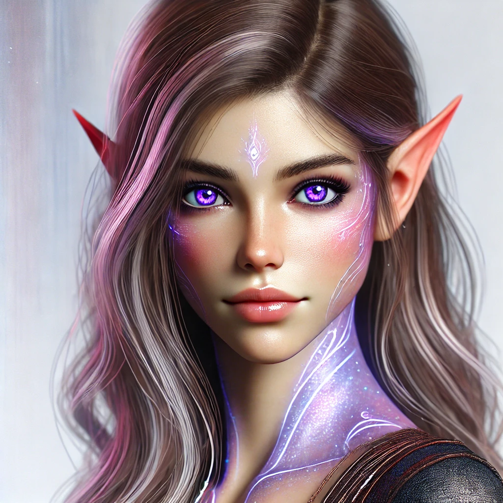

# Nymeria

* Race: she is a mixed blood between human and [essentari.md](../races/essentari.md "mention")
* Gender: female
* Age: 22
* Class:  Thief&#x20;
*   Physical appearance: as a crossbreed between a Human and an [essentari.md](../races/essentari.md "mention"). she has both human and Essentari traits.

    <figure><figcaption></figcaption></figure>
* Faction / group: she worked for the [the-unnamed.md](../associations/the-unnamed.md "mention")
* Abilities:&#x20;
  * Doppelganger: the genes from her [essentari.md](../races/essentari.md "mention") heritage gives her the ability to create a doppelganger (read [essentari.md](../races/essentari.md "mention")Race)
*   Bio:

    [nymeria.md](nymeria.md "mention") was born in the city of [londar.md](../cities/londar.md "mention")22 years ago in the Year 712 by a Human man and an  [essentari.md](../races/essentari.md "mention") woman.&#x20;

    Her mother taught her how to summon her essence at the age of 4.&#x20;

    At age of 5 she lost her parents in the [londar.md](../cities/londar.md "mention") attack in the Year 717. During the attack her father protect her from arrows that killed him and her mother. In that moment one member of the [the-unnamed.md](../associations/the-unnamed.md "mention")saw her crying over her parents bodies and also saw her twin/essence and the physical traits of an [essentari.md](../races/essentari.md "mention") and decided to take her and her essence with them to save her life but also, because he knew that an [essentari.md](../races/essentari.md "mention") is extremely rare to find and if trained well her ability could serve very well the [the-unnamed.md](../associations/the-unnamed.md "mention").

    So [nymeria.md](nymeria.md "mention") grew up in an environment where she was trained in the art of burglary, shoplifting, pickpocketing and stealing in general, all abilities that she excelled on thanks to her Essence helping her. The few guildmates she got to know during the years in the guild treated her like you would treat a stray dog, with indifference, often whispering among themselves wondering the reason why she was working the guild, given her scarce ability with the sword.&#x20;

    She didn't mind that because she knew her role was special and her supervisors always made her clear that her abilities and work was to be kept absolutely secret. The [the-unnamed.md](../associations/the-unnamed.md "mention") secretly work for [the-crimson-shields-legion.md](../associations/the-crimson-shields-legion.md "mention") which publicly operated as a mercenary organization affiliated with the crown, it also conducted dirty operations in the shadow: thieveries, assassinations and kidnapping, for everyone who would pay well. [nymeria.md](nymeria.md "mention")knew only a small fraction of the dark side of the guild. She was only tasked with some small stealing, a bag containing papers from that noble, a small canister from an alchemist lab, a box from a treasure room of a wealthy family and sometimes also implanting letters and documents. She always knew that this wasn't a nice conduct but she thought that she wasn't harming anyone and that if it wasn't for the guild she would have been dead or ended up prostituting since childhood. The guild was her house, and to some extent also her family.&#x20;

    In the year 732 she was tasked to participate to a masquerade ball hosted by a very wealth noble family. She had to implant evidence of the husband's betrayal with another woman but she was caught by a young man: [gareth-feld.md](../side-characters/gareth-feld.md "mention") who removed the implanted proofs and followed her to an alley where he confronted her (I was thinking that he fell in love with her appearance and wanting to know her personality he made a bet with her: he challenged her to a drinking competition, if he passed out before her than she could take the implanted proofs and finished her job otherwise she would give him a date. Then of course he loses the bet but before he does it he said something to her to make her doubt her line of work and whole purpose of existence). In time they meet again and again and they fall in love. They stay together 1 year till [gareth-feld.md](../side-characters/gareth-feld.md "mention")is killed in the year 733 by [luna.md](luna.md "mention"), one of the main characters who also worked for the [the-ashen-cloaks-tac.md](../associations/the-ashen-cloaks-tac.md "mention") but she was an assassin for the branch of another city: [parith.md](../cities/parith.md "mention").&#x20;
* Side-quest: [nymeria.md](nymeria.md "mention") joined the [mc.md](mc.md "mention")party because some executive of the [the-unnamed.md](../associations/the-unnamed.md "mention")promised her to use all the guild's resources to find the killer of the [gareth-feld.md](../side-characters/gareth-feld.md "mention")to satisfy her need for revenge but in order to do that [nymeria.md](nymeria.md "mention")would need to investigate ...
