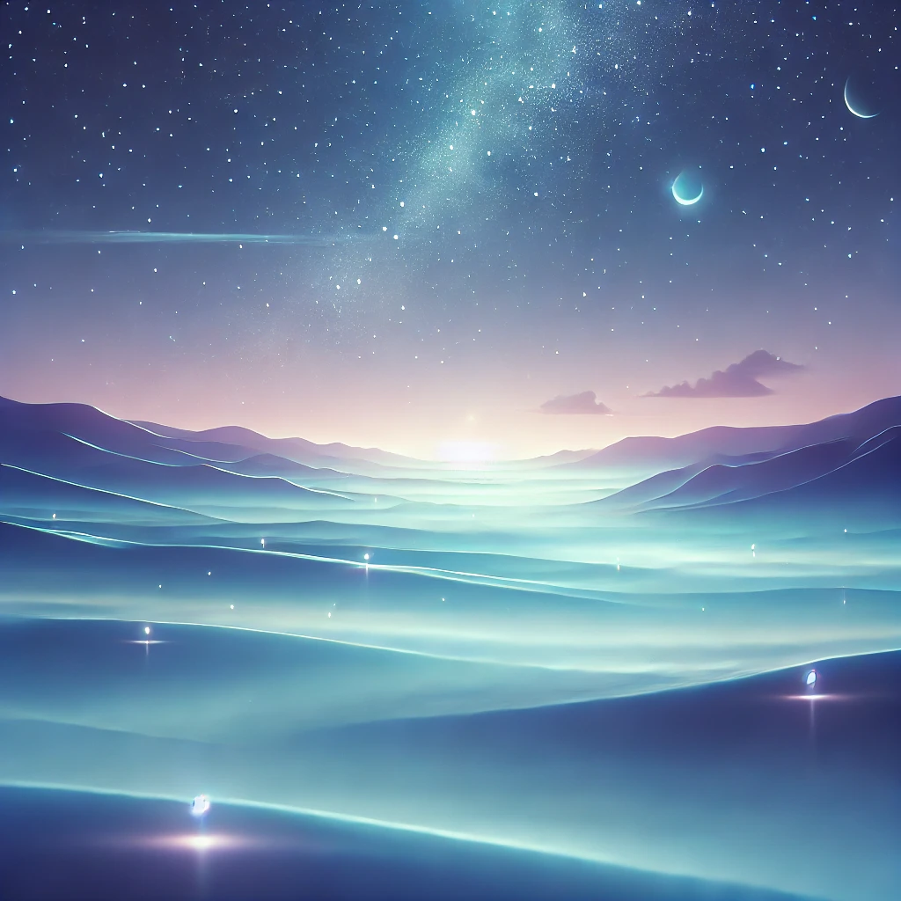

# Netherveil

The Netherveil is a serene, non-material dimension characterized by a calm, glowing mist in shades of blue and purple. The landscape features smooth, ethereal surfaces with faint, gentle lights and translucent energy fields, creating a tranquil and otherworldly ambiance perfect for resting spirits.

<figure><figcaption></figcaption></figure>

The Netherveil inhabitants are born together with an [essentari.md](../races/essentari.md "mention"). Their only purpose to exist is to be in sync with their Essentari and to be summoned by them.&#x20;

Their life in the Netherveil knows no pleasure, no pain, no boredom, no feeling whatsoever. It is like when they are in the Netherveil they are awake but sleep at the same time.

When their Essentari dies, the essence just vanishes. When the essence dies the Essentari still lives on like nothing happened.&#x20;

<figure><figcaption></figcaption></figure>
