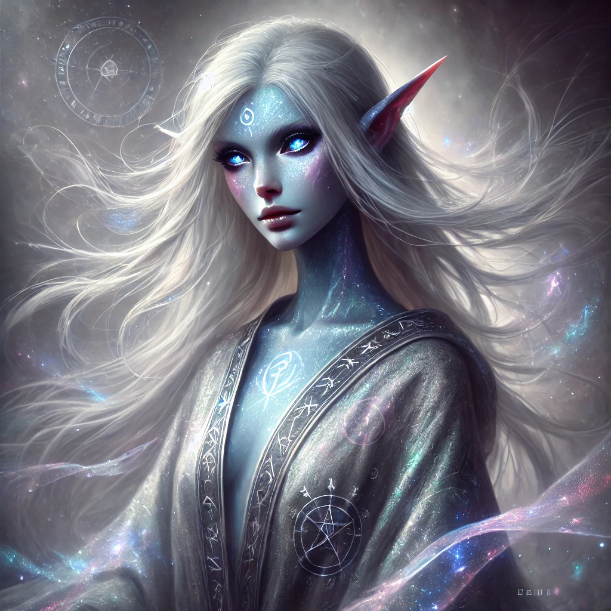

# Essentari

**Physical appereance**: the Essentari are a mystical race with distinctive eyes (deep purple or silver), iridescent skin, and uncommon hair colors (silver, white, blue, or green). They have an athletic, graceful build and favor flowing, color-changing garments with runic symbols, and jewelry made from pulsing crystals. They possess a faint aura, slightly pointed ears, and a melodic, echoing voice.&#x20;

<figure><figcaption></figcaption></figure>

**Description**: When an Essentari s born, an essence/spirit also is born few seconds later in  the plane of existence [netherveil.md](../planes-of-existence-spheres/netherveil.md "mention") that shares a link with the newborn in the main plane of existence. This link allows the firstborn, the one with a physical form, to summon the essence/spirit by shedding some blood and using a specific enchantment that allows the spirit to take form with the same exact shape and voice of the firstborn, but the summoner has to give half of his/her strengths and he/she will be deprived of this strength as long as the spirit/essence is still on the same plane of existence. The second born's new shape form shares memories but not feelings, it can stay in the same plane only for 24 hours exceeding that it will grow weaker and weaker till the death of the essence.

&#x20;It cannot be summoned after another 24h\
